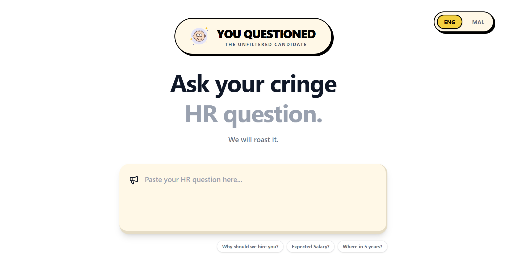

# The Unfiltered Candidate

React frontend for The HR Roaster application with a modern dark mode interface.



## Setup

1. Install dependencies:

```bash
npm install
```

2. Run the development server:

```bash
npm run dev
```

The app will be available at `http://localhost:5173`

## Features

- 🎨 **Modern Dark Mode UI** with neon purple and lime green accents
- 💬 **Large Input Area** for pasting HR questions
- 🔥 **Pulsing ROAST ME Button** with hover effects
- ⏳ **Loading States** with "Consulting the Council of Sarcasm..." message
- 🎴 **Animated Result Card** with flip-in animation
- 📊 **Unemployability Score** with animated progress bar
- 📋 **Share to Clipboard** functionality
- ⚡ **Keyboard Shortcut** - Ctrl+Enter to roast

## Tech Stack

- React 18
- Vite
- Tailwind CSS
- Modern CSS animations

## Usage

1. Make sure the backend is running at `http://localhost:8000`
2. Paste an HR interview question in the text area
3. Click "ROAST ME" or press Ctrl+Enter
4. Enjoy your brutally honest, sarcastic answer!
5. Share the roast using the clipboard button
